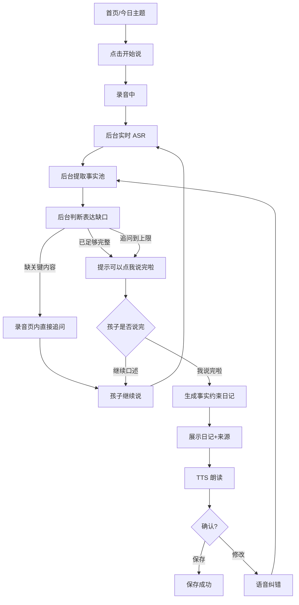

# 童心日记 - 小朋友端最小 MVP 产品说明书

版本：v0.2 MVP  
形态：微信小程序，小朋友端优先  
目标用户：5-9 岁儿童  
核心原则：孩子只负责说，系统在后台听、想、追问和整理；结束口述由孩子明确确认。

## 1. MVP 目标

用最短路径上线一个能证明核心价值的小程序：

1. 孩子从今日主题进入，点一次开始后就进入连续口述体验。
2. 系统在录音过程中后台进行 ASR、事实提取、完整度判断。
3. 需要追问时，小程序直接用“小耳朵兔”语音/气泡提示孩子继续说，不让孩子反复点下一步。
4. 孩子点击“我说完啦”后，系统生成一篇事实约束日记，所有事实都来自孩子口述。
5. 孩子能听朗读、确认保存，或用语音说“不是这样”进行修改。

MVP 要证明的不是“AI 会写作文”，而是：

> AI 能在孩子表达时判断还缺什么，并用最少操作帮助孩子把自己的故事说完整。

## 2. 非目标

本阶段不做：

- 老师端、家长端、成长报告。
- 排行榜、复杂打卡、积分商城。
- 长文作文生成。
- 自由文本编辑器。
- 多主题后台和运营系统。
- 多孩子账号体系。
- 图片生成和复杂装饰。
- 真实复杂 TTS 音色管理。

## 3. 设计原则

### 3.1 小程序优先

- 竖屏手机页面，按 375px 宽度设计。
- 底部主操作区固定，按钮足够大。
- 不使用 PC 侧栏、多列面板、复杂步骤导航。
- 信息分层：当前该做什么最大，后台状态轻量提示。

### 3.2 儿童低操作负担

旧方案问题：每一步都要孩子点，像成人流程表单。

新版原则：

- 开始后尽量连续完成。
- 孩子核心操作尽量压到 2 次：开始说、我说完啦；中间直接继续说，不需要专门点击。
- ASR、AI 判断、事实提取、追问准备都在后台自动进行。
- 需要追问时，不进入新页面，只在对话中出现一句问题。
- 系统可以通过静音和完整度提示“可以说完了”，但不能在孩子未确认时强制结束。

### 3.3 AI 不代写

- 事实池只记录孩子说过的内容。
- 最终日记不得新增孩子没说过的人物、地点、天气、颜色、数量、动作、情绪、评价。
- 可以做轻微整理：删口头禅、调整顺序、补连接词。
- 每句话都能显示来源。

## 4. 核心流程



## 5. 页面与状态

### 5.1 首页

目标：让孩子快速进入今日表达。

页面元素：

- 小耳朵兔头像。
- 今日主题卡片：今天你帮助别人做了什么？
- 一个主按钮：开始说。
- 弱提示：说一句也可以。

状态：

- `idle`：默认首页。
- `draft_available`：有未完成草稿，按钮变为继续说。
- `saved_today`：今天已完成，可再说一篇。

### 5.2 录音/陪伴页

这是 MVP 最核心页面。

页面元素：

- 顶部：主题。
- 中部：小耳朵兔听的动画、波形、当前提示。
- 对话流：孩子说的话、AI 追问、后台状态。
- 底部：主结束按钮“我说完啦”。录音中不要求点击“这句说完”，孩子可以直接继续说。

后台状态提示：

- 正在听你说。
- 小耳朵正在把话变成文字。
- 已听到 3 个小事实。
- 还想知道你的感觉。
- 故事已经够完整啦，可以点“我说完啦”。

追问规则：

- 追问不跳页。
- 每次只问一个问题。
- 最多 6 个非阻塞核心问题；问题会保留在聊天区，孩子可选择回答顺序。
- 追问文案要儿童化、具体，并自然引用孩子刚说到的人物、物品、动作、关系或事件。
- 追问由模型根据本次口述动态生成，不按某几个关键词映射预设问题。
- 每个问题以小对话框依次保留在聊天区，实时事实更新不能覆盖问题。
- 问题是可选表达提示，不要求孩子按顺序回答；未回答前一个问题也不阻塞后续不同问题。
- 孩子之后补充任意问题的答案，新增内容继续进入同一个事实池，结束时统一整理。
- 相邻问题之间至少需要一段新的有效口述，避免连续弹问；MVP 最多保留 6 个核心问题。

示例：

> 擦完桌子的时候，你是什么感觉呀？

结束判定：

- 第一优先级：孩子点击“我说完啦”，立即停止本轮收音并进入生成。
- 第二优先级：连续静音 3-5 秒且已有最低事实时，提示“你说完了吗？”但不自动生成。
- 第三优先级：AI 判断故事已完整时，提示“故事已经够完整啦，可以点我说完啦”。
- 如果孩子继续说，继续追加事实，不覆盖之前事实。

### 5.3 日记确认页

目标：让孩子看见结果，并知道它来自自己。

页面元素：

- 日记卡片。
- “听小耳朵读一遍”按钮。
- 事实来源标签，如“来自第 1 次说话”。
- “就是这样”主按钮。
- “我想改一下”次按钮。

### 5.4 语音修改页

目标：不用键盘修改事实。

页面元素：

- 修改提示：“直接说原来哪里不对，以及想改成什么。”
- 录音按钮。
- 修改后自动回到日记确认页。

MVP 支持：

- 替换事实：不是 A，是 B。
- 补充事实：我还想说，我很开心。
- 删除误识别事实：我没有说 A。

## 6. AI 逻辑

### 6.1 后台流水线

录音开始后，后端可以按分段音频处理：

1. `speech_to_text`：语音转文字。
2. `extract_facts`：从当前文本抽取事实。
3. `merge_facts`：合并进事实池，去重。
4. `check_slots`：判断表达缺口。
5. `decide_next_action`：先识别孩子最后提到但没讲清的对象、关系或事件，再动态生成紧贴原话的追问；故事已完整时停止追问。
6. `compose_diary`：事实约束生成。
7. `validate_diary`：检查日记是否引入未授权事实。

### 6.2 完整度维度

MVP 使用 5 个槽位：

- `who`：谁。
- `what`：做了什么。
- `detail`：怎么做/看到什么。
- `feeling`：孩子感受。
- `result`：结果/别人反馈。

最低生成条件：

- 有 `what`。
- 至少有 `detail`、`feeling`、`result` 中两项。
- 或已经显示 6 个核心问题，不再继续增加问题。

### 6.3 事实池

```json
{
  "facts": [
    {
      "id": "f1",
      "slot": "what",
      "text": "我帮妈妈擦桌子",
      "source_turn": 1,
      "source_quote": "我帮妈妈擦桌子"
    },
    {
      "id": "f2",
      "slot": "detail",
      "text": "我的手湿湿的",
      "source_turn": 1,
      "source_quote": "我的手湿湿的"
    }
  ]
}
```

### 6.4 下一步决策

```json
{
  "action": "ask_followup",
  "reason": "missing_feeling",
  "question": "擦完桌子的时候，你是什么感觉呀？",
  "facts_added": ["f1", "f2", "f3"]
}
```

可选 `action`：

- `keep_listening`：继续听，不打断。
- `ask_followup`：追问一次。
- `suggest_finish`：内容已足够完整，提示孩子可以说完。
- `compose`：孩子点击“我说完啦”后生成日记。
- `safety_stop`：触发安全兜底。
- `retry_asr`：识别失败，温和重试。

### 6.5 日记输出

```json
{
  "title": "我帮妈妈擦桌子",
  "body": "今天我帮妈妈擦桌子。我的手湿湿的，但是妈妈说我擦得很干净。我很开心，因为妈妈夸我了。",
  "sentence_sources": [
    {
      "sentence": "今天我帮妈妈擦桌子。",
      "fact_ids": ["f1"]
    },
    {
      "sentence": "我的手湿湿的，但是妈妈说我擦得很干净。",
      "fact_ids": ["f2", "f3"]
    },
    {
      "sentence": "我很开心，因为妈妈夸我了。",
      "fact_ids": ["f4"]
    }
  ]
}
```

## 7. 安全与异常

### 7.1 内容安全

需要识别：

- 自伤、自杀、严重负面情绪。
- 暴力、欺凌、性相关内容。
- 明确现实危险。
- 成人隐私信息。
- 仇恨、辱骂、攻击表达。

儿童端提示：

> 这个事情有点重要，我们先请大人一起听一听。

### 7.2 异常处理

- 麦克风权限拒绝：提示开启权限。
- 录音太短：提示“再多说一点点，好吗？”
- ASR 失败：提示“刚才没听清，我们再试一次。”
- 浏览器实时识别会话意外结束：录音仍进行时自动创建新识别会话，并保留此前累计文字。
- 检测到麦克风持续有声音、但实时字幕超过约 6 秒没有结果时，主动重建浏览器识别会话。
- 录音过程中每隔约 6 秒把新增音频送腾讯识别；浏览器字幕卡住时，腾讯分段结果继续补充文字并触发分析。
- 页面焦点切换或恢复可见：检查麦克风轨道和实时识别状态，必要时自动恢复，不要求孩子重新点击。
- ASR 返回空文本或失败：不得用演示文案替代孩子真实口述。
- AI 超时：先保存原始口述为草稿。
- TTS 失败：可继续确认保存。
- 保存失败：本地缓存，稍后自动重试。

## 8. 数据结构

### diary_session

```json
{
  "session_id": "s_001",
  "child_id": "c_001",
  "theme_text": "今天你帮助别人做了什么？",
  "status": "confirmed",
  "turn_count": 2,
  "followup_count": 1,
  "created_at": 1789584000000,
  "updated_at": 1789584300000
}
```

### voice_turn

```json
{
  "turn_id": "t1",
  "session_id": "s_001",
  "kind": "initial",
  "audio_url": "cloud://...",
  "asr_text": "今天我帮妈妈擦桌子，然后我的手湿湿的，妈妈说我擦得很干净。",
  "asr_confidence": 0.91
}
```

### fact

```json
{
  "fact_id": "f1",
  "session_id": "s_001",
  "slot": "what",
  "text": "我帮妈妈擦桌子",
  "source_turn_id": "t1",
  "source_quote": "我帮妈妈擦桌子",
  "is_active": true
}
```

### diary

```json
{
  "diary_id": "d1",
  "session_id": "s_001",
  "title": "我帮妈妈擦桌子",
  "body": "今天我帮妈妈擦桌子。我的手湿湿的，但是妈妈说我擦得很干净。我很开心，因为妈妈夸我了。",
  "sentence_sources": [
    {
      "sentence": "今天我帮妈妈擦桌子。",
      "fact_ids": ["f1"]
    }
  ],
  "status": "confirmed"
}
```

## 9. 验收标准

### 9.1 交互验收

- 首屏是小程序竖屏界面，不是 PC 控制台。
- 首页只有一个主要行动：开始说。
- 开始后 ASR、AI 判断、事实提取在后台自动进行。
- 追问直接出现在录音陪伴页，不跳到复杂步骤页。
- 录音页必须有明确结束入口：“我说完啦”。
- 核心口述到生成日记最多需要点击 2 次：开始说、我说完啦；中间追问直接显示在屏幕上，孩子直接继续说。

### 9.2 AI 验收

- 最终日记每个事实都能追溯到孩子口述。
- 没说过的天气、地点、颜色、夸张描写不得出现。
- 追问不超过 6 次，相邻问题之间必须有新的有效口述。
- 追问必须能从孩子当前口述中找到明确锚点，不能连续出现与内容无关的通用问题。
- 孩子已补足事件及至少两类细节、感受或结果后，应停止追问并提示可以结束。
- 可以直接生成短日记，不强行扩写。
- 成文应调整语序、合并重复口语、补足必要语法成分和连接词，使句子完整且事件顺序清楚；不得新增事实或虚构因果。

### 9.3 儿童体验验收

- 主按钮不小于 64px 高。
- 文案短，一屏只强调当前动作。
- 页面颜色统一：奶油白、暖橙、嫩绿。
- 修改不依赖键盘。

## 10. 后续 P1

1. 家长听日记与语音回应。
2. 老师发布主题。
3. 独立完整表达率统计。
4. 多事件识别与选择。
5. 更完整内容安全策略。
6. 儿童表达成长档案。
7. 真实 TTS 接入。
8. 主题模板库。

## 11. 当前高保真原型已实现

### 11.0 微信原生小程序

- `wechat-miniapp/` 是可直接导入微信开发者工具的原生项目，不使用 `web-view` 套壳。
- 录音使用 `wx.getRecorderManager()`，后台约每 6 秒自动形成一段 WAV 并续录，孩子不需要操作分段。
- 每段录音通过 `wx.uploadFile()` 发送到现有 `/api/asr`，累计文本后调用 `/api/analyze` 实时抽取事实和生成非阻塞问题。
- 点击或说“我说完啦”后等待全部分段上传完成，再执行最终事实审计和 `/api/compose` 成文。
- “我想改一下”使用同一原生录音链路，调用 `/api/revise` 后重新执行事实约束成文。
- 开发者工具模拟器默认连接 `http://127.0.0.1:5182`；真机需要把 `utils/config.js` 改为手机可访问的局域网地址或 HTTPS 测试域名。
- `project.config.json` 当前使用 `touristappid` 占位；真机预览前必须替换为比赛小程序 AppID。

`tongxin-diary-mvp.html` 已实现一套前端模拟状态机：

- 开始说后自动进入录音陪伴页。
- 开始说后持续收音，孩子不需要每句都点结束。
- 前端调用浏览器麦克风录音，并上传到 `/api/asr`。
- Chrome 环境下优先使用浏览器实时语音识别，能直接得到用户真实口述文本。
- 识别文字出现后会实时抽取事实、判断缺口，并在屏幕上显示追问。
- 引导问题使用小对话框依次保留在聊天记录中，不再被事实数量等状态提示刷掉。
- 未回答的问题不会阻塞后续引导，孩子可以继续讲，也可以看到问题后稍后再补充。
- 浏览器识别会话结束、窗口重新获得焦点或页面恢复可见时，会自动检查并恢复识别；底层录音轨道持续工作。
- 实时识别采用双通道：浏览器字幕负责低延迟，腾讯分段识别负责持续性兜底，结束时再用整段音频复核。
- 浏览器字幕和腾讯字幕不直接拼接：浏览器结果新鲜时优先显示浏览器，停滞超过约 8 秒才切换腾讯结果，避免重复。
- 独立字幕栏只显示完整识别文本末尾约 46 个字，确保两行内能看到最新内容；后台仍保留完整文本用于事实抽取和成文。
- 最新识别文字的显示优先级高于“继续说”“可以结束”等状态提示；新增引导问题不得覆盖正在更新的字幕。
- 录音动画只在真实收音状态显示，未收音时隐藏，避免误导。
- `server.js` 提供本地后端服务，负责静态页面和音转文接口。
- 已接入腾讯云一句话语音识别：前端上传 16k 单声道 WAV 到 `/api/asr`，后端调用 `SentenceRecognition`。
- 未配置真实 ASR 时可进入演示模式；真实 ASR 已配置但识别为空或失败时明确报错，不用模拟文本冒充孩子口述。
- 已接入通义千问：`/api/analyze` 负责事实抽取和追问判断，`/api/compose` 负责事实约束成文。
- `/api/analyze` 根据每次真实口述动态定位未讲清的对象、关系或事件并生成问题，不为具体示例词编写业务规则。
- 千问不可用时仅做有限本地兜底并明确状态。
- 事实池按来源保存，不重复加入同一事实。
- AI 根据缺口自动追问，当前 MVP 上限为 6 个非阻塞问题。
- `/api/compose` 可重组语序、合并重复、加入不改变事实的连接词，并要求每句话返回所使用的事实来源。
- 点击结束后执行独立事实审计，逐句补齐实时阶段漏掉的人物、共同活动、时间变化和后续事件。
- 成文完成后检查所有有效事实是否被使用；模型遗漏的事实必须补回，修改未涉及的信息不得消失。
- “记不清、不知道、不确定、可能、猜测”等内容不作为确定事实进入日记，尤其不得把猜测的衣服、颜色或外貌写成肯定描述。
- 同一活动的连续动作应合并成一个完整事件，感受放在对应事件之后；事实覆盖校验发现遗漏时先让模型重新融合，不直接机械追加重复句。
- 每个独立句子按小学低年级表达标准组织清楚主语和谓语，需要宾语时补齐宾语；地点或时间放在句首后仍必须写出“我、我们、爸爸、妈妈、老师”等明确主语。
- 回家、吃晚饭、洗澡、睡觉等属于收尾节点，收尾节点之后禁止再出现此前的公园、学校或白天活动；事实遗漏只能整体重排，不能追加到文章末尾。
- 成文保留孩子自己说过的形容和有特点的表达，同时去掉重复口头禅；“然后”按真实时序改为“……之后、接着、后来、最后”或自然分句，全文最多保留一次。
- 语音修改给出同一事件的正确说法时，应替换原错误事实并清除其近似重复版本，不能只新增正确句而继续保留错误句。
- 修改页只展示浏览器最终识别或腾讯累计识别的完整内容，不展示正在变化的半句临时结果；提交时再用整段录音复核，修改完成后重新执行事实去重、主谓宾整理、时间排序和事实校验。
- 修改页使用独立的较高录音区域，识别文字超过可见高度时允许内部滚动，不能因复用普通录音卡片高度而裁掉半行文字。
- 点击或语音触发结束后立即进入单次整理锁，按钮禁用，禁止重复提交；完成后自动进入日记页。
- 引导优先原因、关键过程、结果和感受；衣服、颜色、外貌、物品去向等低价值细节默认不追问，故事已有事件、过程和感受时允许提前结束引导。
- 随机字母、重复音节、无意义逗趣或不雅起哄不进入事实池，系统只温和提示回到真实故事，不围绕乱说内容追问。
- 孩子点击“我说完啦”后才生成日记，系统不会擅自结束。
- 没回答心情时生成短日记，不自动补情绪。
- 日记每句话绑定 `factIds`，页面展示来源。
- 保存前执行事实校验，通过后显示“事实校验通过”。
- “我想改一下”会自动启动麦克风，腾讯复核真实修改语音后调用 `/api/revise`。
- `/api/revise` 只返回带事实 ID 的替换、删除或补充操作；无法匹配时不修改，不使用默认语句。
- 修改操作执行后重新事实约束成文；成文或校验失败时回滚到修改前事实。
- 支持 TTS 朗读模拟和本地保存模拟。

本地运行方式：

```bash
cd /Users/zqy/127space/口述日记-幼儿版
node server.js
```

然后打开：

```text
http://127.0.0.1:5178/
```

注意：不要直接双击 HTML 文件测试录音。浏览器在 `file://` 下无法正常调用 `/api/asr`，麦克风权限和上传也不稳定。

测试真实语音文本：

- 推荐使用 Chrome 打开 `http://127.0.0.1:5178/`。
- 点击开始后，若页面提示“开始收音和实时识别”，说明正在使用浏览器语音识别，会优先采用你真正说的话。
- 若页面提示“当前未配置真实 ASR，后端返回模拟识别文本”，说明没有浏览器实时识别结果，也没有配置后端 ASR，所以才会出现默认文案。
