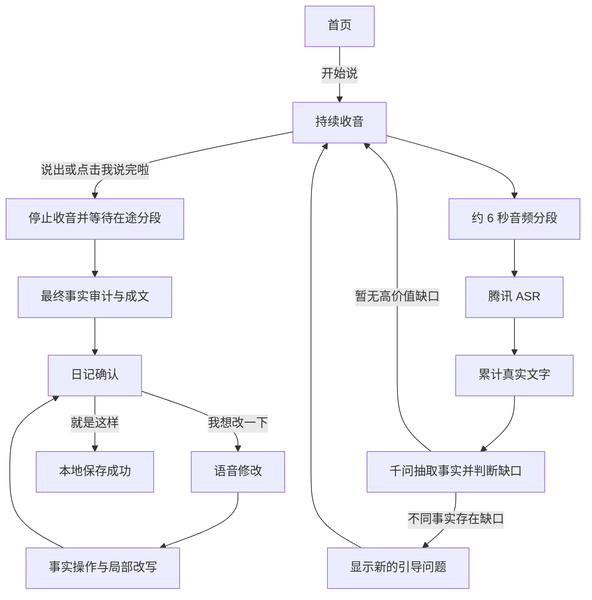

# 童心日记：小朋友端 MVP 产品说明书

版本：v0.5
更新日期：2026-10-08
产品形态：原生微信小程序
目标用户：5-9 岁儿童

## 1. 产品目标

童心日记帮助孩子把零散口述整理成属于自己的完整日记。孩子点击一次开始说，系统持续收音、实时转写、抽取事实并显示引导问题；孩子说完后再点击一次结束，系统生成事实可追溯的日记。

MVP 需要验证三个核心价值：

1. 孩子只需“开始说”和“我说完啦”两次主要点击。
2. AI 能根据本次真实口述持续发现不同事实的表达缺口，并给出相关问题。
3. 日记只整理孩子说过的内容，不代写、不补造事实。

## 2. 当前范围

### 2.1 已实现

- 原生微信小程序竖屏界面。
- 微信录音持续分段收音。
- 腾讯云语音识别。
- 通义千问事实抽取、表达缺口判断和动态追问。
- 实时字幕末尾三行展示。
- 多条引导问题保留并自动定位到最新一条。
- 点击或说“我说完啦”结束口述。
- 最终事实审计与事实约束成文。
- 每句话展示事实来源。
- 语音替换、删除或补充事实。
- 修改基于第一版日记局部更新，未涉及句子保持不变。
- 日记保存到服务器，支持历史查询、恢复修改和删除；本地存储作为离线副本。

### 2.2 本期非目标

- 家长端、老师端和成长报告。
- 多孩子账号、家庭共享和跨账号同步。
- 排行榜、积分、打卡和社交功能。
- 文本编辑器和键盘修改。
- TTS 朗读。
- 图片生成、配图和复杂动画。
- 多主题运营后台。
- 离线语音识别。

## 3. 核心原则

### 3.1 少操作

- 开始后持续收音，中途不需要点击“这句说完”。
- 引导问题直接出现在当前页面，不进入问答步骤页。
- 问题只作为提示，不要求按顺序逐个回答。
- 系统不会因为静音或内容完整而擅自结束。

### 3.2 事实约束

- 人物、地点、时间、动作、物品、颜色、数量、结果和感受都必须来自孩子口述。
- 可以删除口头禅、合并重复、调整语序并加入不改变事实的连接词。
- 不确定、猜测、乱说和识别纠错过程不进入日记。
- 每个日记句子必须关联实际使用的事实。

### 3.3 儿童表达训练

- 每个独立句子有明确主语和谓语，需要宾语时写清宾语。
- 同一事件的连续动作合并表达，不重复叙述。
- 按真实时间顺序组织事件，感受放在对应事件之后。
- 保留孩子自己的形容和有特点的说法。
- 避免全篇反复使用“然后”，可自然改为“接着、后来、最后”等。

## 4. 用户流程



## 5. 页面与状态

### 5.1 首页 `home`

- 小耳朵兔形象。
- 今日主题：“今天你帮助别人做了什么？”
- 主按钮：“开始说”。

点击后申请麦克风权限并进入口述页。

### 5.2 口述页 `listen`

页面从上到下包含：

1. 当前主题。
2. 收音状态、小耳朵兔和真实收音波形。
3. “刚刚听到”字幕区，固定约三行，新增文字自动滚到末尾。
4. 引导问题区，保留历史问题并自动定位到最新问题。
5. 实时事实标签。
6. “继续说就好”和“我说完啦”。

录音状态：

- `opening`：正在申请权限或启动录音。
- `recording`：持续收音并自动分段。
- `finishing`：停止录音、等待在途识别并生成日记；结束按钮禁用。
- `error`：权限、网络或识别失败，显示明确原因，不填入模拟文字。

### 5.3 日记确认页 `diary`

- 日记标题和正文。
- 句子按段着色，便于儿童阅读。
- 每句话对应的事实来源。
- “事实校验通过”提示。
- “就是这样”和“我想改一下”。

### 5.4 语音修改页 `revise`

- 进入页面后自动开始录音。
- 提示孩子完整说出替换、删除或补充内容。
- 实时显示修改口述。
- 点击“说好了，帮我改”后只处理本次明确修改。
- 停止收音后隐藏波形并锁定按钮，防止重复提交。
- 没有识别出明确修改时停留在修改页并允许重新录音，不显示“已恢复版本”的误导提示。
- 重新录音前清空上一轮修改口述，避免两轮指令混在一起。

### 5.5 日记本 `history / historyDetail`

- 首页“我的日记”显示服务器已保存篇数。
- 历史列表按保存时间倒序展示日期、标题和正文摘要。
- 点击任意记录可查看完整正文和事实来源。
- “恢复并修改”沿用原日记 ID；保存后更新原记录，不额外新增一篇重复日记。
- 旧版历史数据缺少 `factIds` 时，根据 `factTexts` 与事实池补全关联后再进入修改。
- 详情页支持二次确认后删除，服务器采用软删除。
- 查询历史只读取锁定后的保存结果，不重新调用模型生成。

### 5.6 保存成功页 `success`

- 日记上传服务器 SQLite 数据库，按微信身份隔离，不覆盖以前的日记。
- `diaryHistory` 和 `latestDiary` 作为本机离线副本，云端失败时下次启动自动重试。
- 显示保存成功。
- 可进入日记本或点击“再讲一篇”重新开始。

## 6. 实时语音与追问逻辑

### 6.1 连续收音

- 使用 `wx.getRecorderManager()`。
- 只有收到微信录音管理器的 `onStart` 事件后，页面才显示正在收音和波形，避免把启动失败误显示为收音中。
- 音频格式为 16kHz、单声道 WAV。
- 每约 6.2 秒主动结束一个分段，约 120ms 后自动开启下一段。
- 分段停止后立即上传，上传与下一段录音并行。
- 页面普通点击和滚动不影响录音。

### 6.2 字幕累计

- 每段真实 ASR 文本合并到完整口述。
- 完全相同或包含关系的重复分段不再次追加。
- 后台保留完整口述用于事实分析。
- 页面只展示末尾约 86 个字，并用动态锚点定位到最后一行。
- ASR 失败只显示错误提示，禁止插入演示文案。

### 6.3 动态追问

- 每次获得新文字后调用 `/api/analyze`。
- 模型结合完整口述、最新分段、已有事实和已问问题判断下一步。
- 同一个具体事实或事件只引导一次。
- 孩子讲出不同的新事实，只要仍有高价值缺口，就可以继续产生新问题直到孩子结束。
- 前一个问题未回答也不阻塞后续不同事实的问题。

### 6.4 说话人与主线过滤

- 每次实时分析先判断新收音属于孩子叙事、家长引导、背景媒体、元对话还是混合内容。
- 家长提示“然后呢”“还有什么没说”、讨论是否说完、纠正说话方式等内容不进入事实池，也不触发针对该内容的追问。
- 电视、广播、短视频或旁人对话中突然出现的台词、口号和成人化长句，如果与主线无清楚人物、地点、时间或活动关系，不进入事实池。
- 结束后的最终审计会重新确定主线，对实时事实池做第二次筛选；被判定为引导话、串音、无关或不确定的事实会在客户端同步停用。
- 同一次出行中的多个活动、饮食、同行人和感受仍属于主线；孩子用“后来”“回家后”“第二天”等明确引入的新事件也应保留。
- 新问题必须引用本次口述中的具体人物、动作、物品、关系或事件。
- 优先级：事件原因或结果 > 关键过程 > 感受 > 必要对象特征。
- 不追问衣服、颜色、外貌、大小、物品去向等低价值细节。
- 重复问题、同义问题和同一目标的二次问题会被过滤。

### 6.4 乱说与不确定内容

- 随机字母、重复音节、无意义逗趣和不雅起哄不进入事实池。
- 系统只温和提示回到真实故事，不围绕乱说词语互动。
- “记不清、不知道、不确定、可能、猜测”等内容不作为确定事实。

## 7. 结束与成文

### 7.1 结束条件

- 点击“我说完啦”；或
- ASR 识别到“我说完了、我说完啦、讲完了、讲完啦”。

系统随后：

1. 停止新录音。
2. 等待所有已上传音频完成识别。
3. 等待最后一次实时分析完成。
4. 只调用一次 `/api/finalize`；后端先完成最终事实审计，再统一进入唯一成文器。
5. 自动进入日记确认页。

### 7.2 第一版日记

`/api/finalize` 是第一版日记的唯一入口，固定执行以下流水线：

1. **完整口述审计**：重新扫描全部 ASR 文字，识别孩子主线故事，排除家长引导、电视串音、操作语句、乱说、猜测和无关事件。
2. **有效事实池**：保留实时阶段已确认事实，补齐完整口述中的遗漏事实，按语义去重；每条事实保留原话依据。
3. **唯一成文器**：以有效事实对应的孩子原话片段为语言主来源，以事实池为内容边界和覆盖账本，按真实时间和事件顺序生成小学低年级可学习的完整句子。
4. **硬校验**：检查事实覆盖、重复事件、主谓结构、时间顺序和连续的“然后”；只有硬校验不通过时才允许一次校对。
5. **锁定第一版**：为每句保存句子 ID、事实 ID 和事实原文，作为后续所有修改的唯一基准。

成文器统一要求：

- 每句话有明确主语和谓语，需要宾语时写清宾语。
- 一句话主要表达一件事或一个连续动作；不同事件按边界断句，不能一直用逗号串联。
- 同一活动的连续动作合并，不能重复表达。
- 优先原样保留收音中的形容词、叠词和儿童化说法，不擅自替换近义词。
- 不新增原话没有的形容词、副词、因果、评价或感受。
- 全文“然后”最多一次；超出时程序判定质量不合格并触发整理，最终仍会做确定性连接词归一。
- 检查事实覆盖、重复事件、病句、时间顺序和主谓结构。

为兼顾效率，正常请求只调用“审计一次 + 成文一次”。校对不能改变有效事实集合，也不能把模型认为遗漏的事实机械追加到文末。

## 8. 语音修改逻辑

### 8.1 事实操作判定

`/api/revise` 先识别修改口述对应的事实，再生成可验证操作：

- `replace`：明确纠正已有事实；“不是 A，是 B”必须替换同一事实，不能保留 A 后再新增 B。
- `delete`：孩子明确说“删掉、不要写、我没说”时，删除指定事实。
- `remove_phrase`：孩子明确要求去掉成文句里的某个词或短语，而它不是独立事实时，直接定位句子删除。
- `add + merge`：新内容是已有事件的细节、结果或感受，绑定 `anchor_fact_id` 并合并到原句。
- `add + before/after`：新内容是相邻事件，按孩子说出的“之前、回家前、之后、后来”放在锚点句前或后。
- `add + independent`：确实是原文没有的新事件，由局部成文器根据时间和语境选择插入位置；无法判断才放到文末。

修改意图不能由口述长度决定。系统结合当前日记、事实来源和本次口述判断 `explicit_edit`、`related_restatement`、`related_addition`、`new_event` 或 `unclear`。孩子不必说出“替换、删除、补充”等固定口令：自然重说与原场景高度相关时，也会进入相关场景融合；只有人物、对象、动作、属性、数量、时间、地点或否定关系明确到不能同时成立时，旧事实才以最新说法为准。同义重述、语序或语气变化不覆盖原事实，本次没有提到但不冲突的旧事实继续保留。

### 8.2 局部成文与一致性

1. 修改始终以页面上当前这一版已锁定日记为基准，不重新调用第一版成文逻辑。
2. `replace/delete/remove_phrase` 先定位受影响句子；相邻受影响句组成一个场景块，允许统一融合、合并或重新断句，不再逐句机械加工。
3. `merge` 融入锚点所在场景块；`before/after` 生成新句并插入场景前后；不同位置的新事实不得强行合成一句。
4. 场景块重整必须覆盖其中仍有效的全部事实，每条来源只绑定一次；否则拒绝模型结果并使用不扩写的确定性兜底。
5. 未涉及句子保持当前版本原文，一个字也不改；局部修改不能删除或改写其他事件。
6. 每个新事实只消费一次，与事实池和当前日记去重；已有内容的重述不得再新增句子。同一场景里的残片、重复和前后补全要综合成完整句子。
7. 找不到明确目标或没有可执行新事实时，不修改原文，留在修改页提示重新表达。

### 8.3 已废弃逻辑

以下逻辑不再使用，代码中不得保留第二套实现：

- 修改时重新生成或重新润色整篇日记。
- 仅根据修改口述长度判断“纠正”还是“续讲”。
- 把所有新增内容一律追加到文末。
- 用句子数量或“所有录音事实必须覆盖”在小程序端回滚修改。
- 使用未被读取的本地修改草稿或另一份第一版快照参与判定。
- 同时保留错误事实和纠正后事实，或把一条新事实在多个句子中重复使用。

### 8.4 通用规则与案例隔离

- 第一版和修改版只使用通用语言、事实与关系规则，正式提示词不得出现某次测试的人名、地点、活动或句子。
- 第一版成文器读取最终审核通过的事实池及其对应的孩子原话片段：原话是措辞和细节的主要来源，事实池是内容边界与覆盖账本。未经审核的整段录音不进入成文器，避免家长声、背景声或无来源内容绕过事实账本。
- 修改版只读取锁定第一版、有效事实与本次修改操作。一个新事实最多被一条修改结果消费一次。
- 测试中出现的个例保存在 `regression-cases/cases.json`，生产服务不读取该文件。
- 个例只有在不同内容中重复出现，或能归纳为违反“事实完整、来源可追溯、关系不变、局部修改、不得重复”之一时，才转化为通用规则。

## 9. 数据结构

### 9.1 实时事实

```json
{
  "id": "f_001",
  "slot": "what",
  "label": "主要事件",
  "text": "我和家人一起完成了一件事",
  "quote": "我跟家人一起做完了这件事",
  "source": "实时识别",
  "active": true
}
```

### 9.2 引导决策

```json
{
  "action": "ask_followup",
  "reason": "missing_result",
  "question": "做完这件事以后发生了什么呀？",
  "target_key": "和家人完成事情",
  "question_status": "pending"
}
```

### 9.3 日记句子

```json
{
  "id": "sentence_001",
  "text": "今天，我和家人一起完成了这件事。",
  "factTexts": ["我和家人一起完成了一件事"],
  "factIds": ["f_001"]
}
```

### 9.4 服务器保存

```json
{
  "diaryHistory": [
    {
      "id": "diary_1789584000000",
      "title": "今天的一件事",
      "sentences": [],
      "transcript": "孩子的完整口述",
      "facts": [],
      "savedAt": 1789584000000
    }
  ]
}
```

- 服务器使用 SQLite WAL 模式，日记绑定服务器验证后的用户，客户端不能自行指定用户。
- 每次保存以日记 id 幂等写入，列表按时间倒序展示。
- 旧版 `latestDiary` / `diaryHistory` 在首次服务器登录后自动上传，不覆盖已有云端记录。
- 历史记录保存最终锁定正文、事实来源、原始口述和有效事实，查询时不重新成文。

## 10. 接口说明

### `POST /api/auth/session`

- 输入：`wx.login()` 产生的临时 code。
- 服务器使用 AppID / AppSecret 换取 `openid`，并返回随机会话令牌。
- AppSecret 只允许放在服务器 `.env`。

### `/api/diaries`

- `POST /api/diaries`：幂等保存日记。
- 从历史记录恢复修改时继续使用原日记 ID，`POST` 更新原记录并保留最初保存时间。
- `GET /api/diaries`：查询当前用户全部未删除日记。
- `GET /api/diaries/:id`：查询日记详情。
- `DELETE /api/diaries/:id`：软删除当前用户的指定日记。
- 以上接口只允许操作会话所属用户的数据。

### `POST /api/asr`

- 输入：`multipart/form-data`，字段 `audio` 为 WAV 文件。
- 服务：腾讯云一句话识别 `SentenceRecognition`。
- 输出：`{ "text": "...", "provider": "tencent" }`。

### `POST /api/analyze`

- 输入：完整口述、最新分段、已有事实、当前问题和历史问题。
- 输出：新增事实、追问决策和语音质量。

### `POST /api/finalize`

- 输入：完整口述、实时事实和历史问题。
- 输出：遗漏事实、标题和带事实来源的句子。

### `POST /api/revise`

- 输入：修改口述、当前有效事实和当前日记。
- 输出：`replace/delete/add` 操作。

### `POST /api/compose`

- 仅用于语音修改后的局部成文。
- 输入锁定日记、修改操作和有效事实。
- 未修改的句子保持不变。

### `GET /health`

- 返回服务状态及腾讯 ASR、千问是否已配置。

## 11. 安全与异常

- 腾讯和千问密钥仅存在后端 `.env`，不进入小程序代码和 Git。
- 微信 AppSecret 仅存在服务器 `.env`；日记、ASR 和 AI 接口均需要 Bearer 会话令牌。
- 未配置模型时接口明确报错，不使用本地演示文字或预设事实冒充结果。
- 麦克风首次拒绝或历史状态为拒绝时，引导用户打开设置；授权成功后自动继续启动录音。
- 用户暂不授权或录音启动失败时保留“重新打开麦克风”按钮，并显示微信返回的错误原因。
- 分段 ASR 失败不停止后续录音，问题区只显示一次对应错误。
- 结束阶段禁止重复点击和重复生成。
- 网络失败时保留当前页面数据，提示检查手机与电脑网络。
- 当前版本尚未接入正式儿童内容安全服务，上线前必须补充高风险内容识别和监护人处理流程。

## 12. 验收标准

### 12.1 核心交互

- 从开始口述到生成日记只需两次主要点击。
- 连续说话至少 60 秒时，录音分段自动续接，不要求手动操作。
- 最新字幕始终可见，旧文字从顶部隐藏。
- 新问题出现后自动滚动到最新一条。
- 没有真实收音时不显示跳动波形。
- 点击结束后按钮立即禁用，且只生成一次。

### 12.2 AI 行为

- 问题与孩子刚说出的具体内容相关。
- 同一事实只问一次，不同新事实可以持续引导。
- 乱说内容不抽取、不追问。
- 家长引导话、说话指令和与主线无关的电视或旁人串音不进入日记。
- 实时阶段误收的串音事实应在最终主线审计后被移除，且不在事实来源中残留。
- 第一版覆盖所有有效事实，每个事实只表达一次。
- 日记不新增孩子未说过的信息。
- 句子主谓清楚、顺序正确、连接自然并保留儿童口吻。
- 修改后未涉及内容与第一版保持一致。
- 替换错误事实后，旧事实和近似重复版本均不再出现。
- 自然重说已有场景时，只局部融合相关事实；未重说且不冲突的内容不丢失，相关事实不重复成句。
- 明确删除生成句中的多余短语时，即使它没有独立事实 ID 也能完成修改。

### 12.3 真机兼容

- iOS 和 Android 微信开发版均能授权麦克风。
- 页面适配常见全面屏，底部按钮不被系统区域遮挡。
- 真机能通过 `https://childdiary.127space.com` 访问 API。
- 小程序后台已配置该 HTTPS 域名为 `request` 和 `uploadFile` 合法域名。

## 13. 后续 P1

1. 正式儿童内容安全与高风险提醒。
2. 数据库自动备份、恢复演练和运维监控。
3. 家长授权后的跨设备历史与数据导出。
4. TTS 朗读与播放状态。
5. 主题选择和主题管理。
6. 家长端听取与回应。
7. 老师发布主题。
8. 独立完整表达率和成长记录。

## 14. 当前技术边界

- 生产 API 地址为 `https://childdiary.127space.com`，需要先完成 DNS、HTTPS 和小程序合法域名配置。
- 日记云端保存使用单机 SQLite；上线后需要配置数据库定时备份。
- ASR 使用短音频连续分段，不是腾讯实时 WebSocket ASR。
- 小程序关闭、系统打断录音或网络切换时，不保证自动恢复当前会话。
- TTS 和正式内容安全尚未实现。
