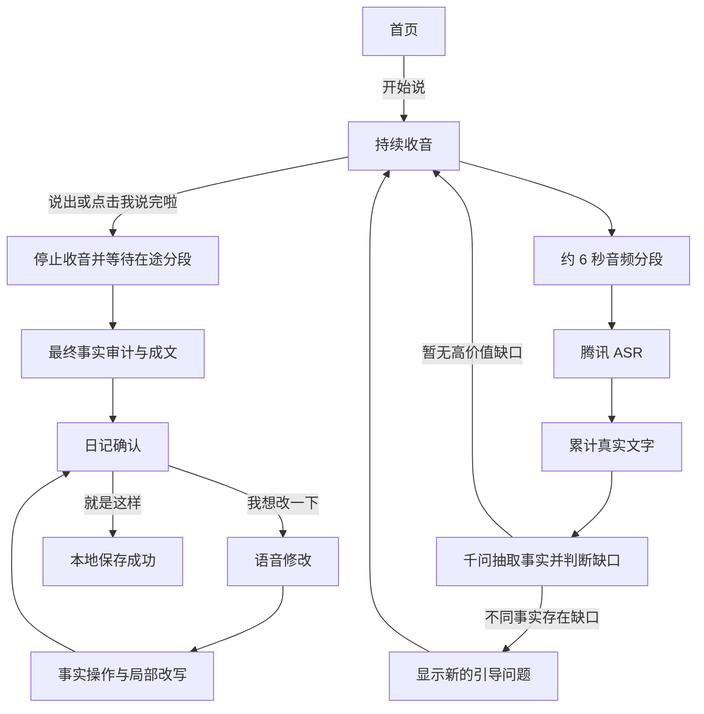

# 童心日记：小朋友端 MVP 产品说明书

版本：v0.4
更新日期：2026-09-23
产品形态：原生微信小程序
目标用户：5-9 岁儿童

## 1. 产品目标

童心日记帮助孩子把零散口述整理成属于自己的完整日记。孩子点击一次开始说，系统持续收音、实时转写、抽取事实并显示引导问题；孩子说完后再点击一次结束，系统生成事实可追溯的日记。

MVP 需要验证三个核心价值：

1. 孩子只需“开始说”和“我说完啦”两次主要点击。
2. AI 能根据本次真实口述持续发现不同事实的表达缺口，并给出相关问题。
3. 日记只整理孩子说过的内容，不代写、不补造事实。

## 2. 当前范围

### 2.1 已实现

- 原生微信小程序竖屏界面。
- 微信录音持续分段收音。
- 腾讯云语音识别。
- 通义千问事实抽取、表达缺口判断和动态追问。
- 实时字幕末尾三行展示。
- 多条引导问题保留并自动定位到最新一条。
- 点击或说“我说完啦”结束口述。
- 最终事实审计与事实约束成文。
- 每句话展示事实来源。
- 语音替换、删除或补充事实。
- 修改基于第一版日记局部更新，未涉及句子保持不变。
- 日记保存到小程序本地存储。

### 2.2 本期非目标

- 家长端、老师端和成长报告。
- 登录、多孩子账号和云端日记列表。
- 排行榜、积分、打卡和社交功能。
- 文本编辑器和键盘修改。
- TTS 朗读。
- 图片生成、配图和复杂动画。
- 多主题运营后台。
- 离线语音识别。

## 3. 核心原则

### 3.1 少操作

- 开始后持续收音，中途不需要点击“这句说完”。
- 引导问题直接出现在当前页面，不进入问答步骤页。
- 问题只作为提示，不要求按顺序逐个回答。
- 系统不会因为静音或内容完整而擅自结束。

### 3.2 事实约束

- 人物、地点、时间、动作、物品、颜色、数量、结果和感受都必须来自孩子口述。
- 可以删除口头禅、合并重复、调整语序并加入不改变事实的连接词。
- 不确定、猜测、乱说和识别纠错过程不进入日记。
- 每个日记句子必须关联实际使用的事实。

### 3.3 儿童表达训练

- 每个独立句子有明确主语和谓语，需要宾语时写清宾语。
- 同一事件的连续动作合并表达，不重复叙述。
- 按真实时间顺序组织事件，感受放在对应事件之后。
- 保留孩子自己的形容和有特点的说法。
- 避免全篇反复使用“然后”，可自然改为“接着、后来、最后”等。

## 4. 用户流程



## 5. 页面与状态

### 5.1 首页 `home`

- 小耳朵兔形象。
- 今日主题：“今天你帮助别人做了什么？”
- 主按钮：“开始说”。

点击后申请麦克风权限并进入口述页。

### 5.2 口述页 `listen`

页面从上到下包含：

1. 当前主题。
2. 收音状态、小耳朵兔和真实收音波形。
3. “刚刚听到”字幕区，固定约三行，新增文字自动滚到末尾。
4. 引导问题区，保留历史问题并自动定位到最新问题。
5. 实时事实标签。
6. “继续说就好”和“我说完啦”。

录音状态：

- `opening`：正在申请权限或启动录音。
- `recording`：持续收音并自动分段。
- `finishing`：停止录音、等待在途识别并生成日记；结束按钮禁用。
- `error`：权限、网络或识别失败，显示明确原因，不填入模拟文字。

### 5.3 日记确认页 `diary`

- 日记标题和正文。
- 句子按段着色，便于儿童阅读。
- 每句话对应的事实来源。
- “事实校验通过”提示。
- “就是这样”和“我想改一下”。

### 5.4 语音修改页 `revise`

- 进入页面后自动开始录音。
- 提示孩子完整说出替换、删除或补充内容。
- 实时显示修改口述。
- 点击“说好了，帮我改”后只处理本次明确修改。
- 停止收音后隐藏波形并锁定按钮，防止重复提交。

### 5.5 保存成功页 `success`

- 日记写入 `latestDiary` 本地存储。
- 显示保存成功。
- 可点击“再讲一篇”重新开始。

## 6. 实时语音与追问逻辑

### 6.1 连续收音

- 使用 `wx.getRecorderManager()`。
- 音频格式为 16kHz、单声道 WAV。
- 每约 6.2 秒主动结束一个分段，约 120ms 后自动开启下一段。
- 分段停止后立即上传，上传与下一段录音并行。
- 页面普通点击和滚动不影响录音。

### 6.2 字幕累计

- 每段真实 ASR 文本合并到完整口述。
- 完全相同或包含关系的重复分段不再次追加。
- 后台保留完整口述用于事实分析。
- 页面只展示末尾约 86 个字，并用动态锚点定位到最后一行。
- ASR 失败只显示错误提示，禁止插入演示文案。

### 6.3 动态追问

- 每次获得新文字后调用 `/api/analyze`。
- 模型结合完整口述、最新分段、已有事实和已问问题判断下一步。
- 同一个具体事实或事件只引导一次。
- 孩子讲出不同的新事实，只要仍有高价值缺口，就可以继续产生新问题直到孩子结束。
- 前一个问题未回答也不阻塞后续不同事实的问题。
- 新问题必须引用本次口述中的具体人物、动作、物品、关系或事件。
- 优先级：事件原因或结果 > 关键过程 > 感受 > 必要对象特征。
- 不追问衣服、颜色、外貌、大小、物品去向等低价值细节。
- 重复问题、同义问题和同一目标的二次问题会被过滤。

### 6.4 乱说与不确定内容

- 随机字母、重复音节、无意义逗趣和不雅起哄不进入事实池。
- 系统只温和提示回到真实故事，不围绕乱说词语互动。
- “记不清、不知道、不确定、可能、猜测”等内容不作为确定事实。

## 7. 结束与成文

### 7.1 结束条件

- 点击“我说完啦”；或
- ASR 识别到“我说完了、我说完啦、讲完了、讲完啦”。

系统随后：

1. 停止新录音。
2. 等待所有已上传音频完成识别。
3. 等待最后一次实时分析完成。
4. 只调用一次 `/api/finalize`；后端先完成最终事实审计，再统一进入唯一成文器。
5. 自动进入日记确认页。

### 7.2 第一版日记

`/api/finalize` 固定执行两阶段流水线：

1. 最终事实审计：扫描完整口述，补齐实时阶段遗漏的事实，过滤噪声、猜测、无效事实和语义重复事实。
2. 唯一成文器：使用全部有效事实，按时间顺序组织符合小学低年级表达的完整句子。

成文器统一要求：

- 每句话有明确主语和谓语，需要宾语时写清宾语。
- 一句话主要表达一件事或一个连续动作；不同事件按边界断句，不能一直用逗号串联。
- 同一活动的连续动作合并，不能重复表达。
- 优先原样保留收音中的形容词、叠词和儿童化说法，不擅自替换近义词。
- 不新增原话没有的形容词、副词、因果、评价或感受。
- 全文“然后”最多一次；超出时程序判定质量不合格并触发整理，最终仍会做确定性连接词归一。
- 检查事实覆盖、重复事件、病句、时间顺序和主谓结构。

为兼顾效率，正常情况固定为“事实审计一次 + 成文一次”；只有硬校验失败时才增加一次局部修复或整体整理请求，不以跳过统一成文器换取速度。

第一版生成后锁定，作为之后所有修改的基准。修改只能局部更新受影响句子，不能重新生成或重新润色整篇文章。

## 8. 语音修改逻辑

支持三类操作：

- `replace`：例如“不是妈妈，是奶奶”。
- `delete`：例如“我没有说去了商场，把那句删掉”。
- `add`：例如“还要加上我最后很开心”。

处理规则：

1. `/api/revise` 把修改口述转换为带事实 ID 的操作。
2. 找不到明确目标时不修改，并提示孩子说清楚。
3. 替换错误事实时同步清除其近似重复版本。
4. 只改写包含受影响事实的句子。
5. 未受影响句子保持第一版原文，一个字也不改。
6. 新增事实生成新句，删除事实后没有有效内容的句子被移除。

## 9. 数据结构

### 9.1 实时事实

```json
{
  "id": "f_001",
  "slot": "what",
  "label": "主要事件",
  "text": "我和哥哥一起玩滑滑梯",
  "quote": "我跟哥哥一起爬滑滑梯又滑下来",
  "source": "实时识别",
  "active": true
}
```

### 9.2 引导决策

```json
{
  "action": "ask_followup",
  "reason": "missing_result",
  "question": "你和哥哥滑下来以后发生了什么呀？",
  "target_key": "和哥哥玩滑滑梯",
  "question_status": "pending"
}
```

### 9.3 日记句子

```json
{
  "id": "sentence_001",
  "text": "在公园里，我和哥哥一起爬上滑滑梯，又从上面滑了下来。",
  "factTexts": ["我和哥哥一起玩滑滑梯"],
  "factIds": ["f_001"]
}
```

### 9.4 本地保存

```json
{
  "latestDiary": {
    "title": "公园里的一天",
    "sentences": [],
    "savedAt": 1789584000000
  }
}
```

## 10. 接口说明

### `POST /api/asr`

- 输入：`multipart/form-data`，字段 `audio` 为 WAV 文件。
- 服务：腾讯云一句话识别 `SentenceRecognition`。
- 输出：`{ "text": "...", "provider": "tencent" }`。

### `POST /api/analyze`

- 输入：完整口述、最新分段、已有事实、当前问题和历史问题。
- 输出：新增事实、追问决策和语音质量。

### `POST /api/finalize`

- 输入：完整口述、实时事实和历史问题。
- 输出：遗漏事实、标题和带事实来源的句子。

### `POST /api/revise`

- 输入：修改口述、当前有效事实和当前日记。
- 输出：`replace/delete/add` 操作。

### `POST /api/compose`

- 仅用于语音修改后的局部成文。
- 输入锁定日记、修改操作和有效事实。
- 未修改的句子保持不变。

### `GET /health`

- 返回服务状态及腾讯 ASR、千问是否已配置。

## 11. 安全与异常

- 腾讯和千问密钥仅存在后端 `.env`，不进入小程序代码和 Git。
- 未配置模型时接口明确报错，不使用本地演示文字或预设事实冒充结果。
- 麦克风权限拒绝时引导用户打开设置。
- 分段 ASR 失败不停止后续录音，问题区只显示一次对应错误。
- 结束阶段禁止重复点击和重复生成。
- 网络失败时保留当前页面数据，提示检查手机与电脑网络。
- 当前版本尚未接入正式儿童内容安全服务，上线前必须补充高风险内容识别和监护人处理流程。

## 12. 验收标准

### 12.1 核心交互

- 从开始口述到生成日记只需两次主要点击。
- 连续说话至少 60 秒时，录音分段自动续接，不要求手动操作。
- 最新字幕始终可见，旧文字从顶部隐藏。
- 新问题出现后自动滚动到最新一条。
- 没有真实收音时不显示跳动波形。
- 点击结束后按钮立即禁用，且只生成一次。

### 12.2 AI 行为

- 问题与孩子刚说出的具体内容相关。
- 同一事实只问一次，不同新事实可以持续引导。
- 乱说内容不抽取、不追问。
- 第一版覆盖所有有效事实，每个事实只表达一次。
- 日记不新增孩子未说过的信息。
- 句子主谓清楚、顺序正确、连接自然并保留儿童口吻。
- 修改后未涉及内容与第一版保持一致。
- 替换错误事实后，旧事实和近似重复版本均不再出现。

### 12.3 真机兼容

- iOS 和 Android 微信开发版均能授权麦克风。
- 页面适配常见全面屏，底部按钮不被系统区域遮挡。
- 手机与电脑同一 Wi-Fi 时能访问局域网 API。
- 正式发布前改用 HTTPS，并配置小程序合法域名。

## 13. 后续 P1

1. 腾讯云或微信云托管部署，替代本机局域网服务。
2. 正式儿童内容安全与高风险提醒。
3. 云端日记保存、账号和历史日记列表。
4. TTS 朗读与播放状态。
5. 主题选择和主题管理。
6. 家长端听取与回应。
7. 老师发布主题。
8. 独立完整表达率和成长记录。

## 14. 当前技术边界

- 当前是测试版，API 地址仍是开发电脑局域网地址。
- 保存仅保留最近一篇到本机小程序存储，没有云同步。
- ASR 使用短音频连续分段，不是腾讯实时 WebSocket ASR。
- 小程序关闭、系统打断录音或网络切换时，不保证自动恢复当前会话。
- TTS、登录、云端数据库和正式内容安全尚未实现。
